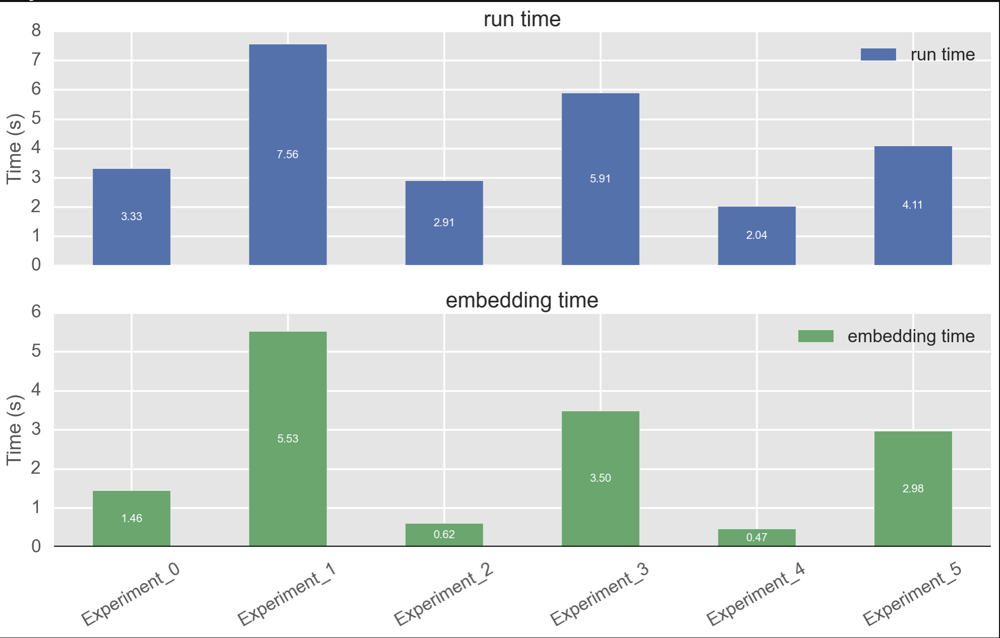
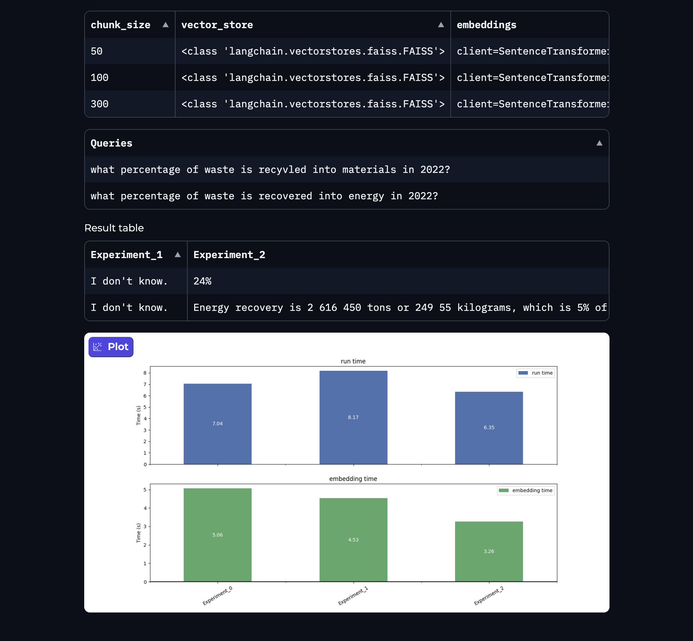

# 💛 Vectorboard - `alpha 0.0.1`

[](https://discord.gg/Ev48fWkbSu)
[](https://github.com/vectorboard/vectorboard)


[](https://twitter.com/vectorboard)
[](https://twitter.com/thehamedmp)

## Embeddings Optimization and Eval Framework for RAG/LLM Applications

**Find the best hyperparameters for Embedding your data in RAG Pipeline**

Get a detailed report on differences between each hyperparameter combination:

- Performance and embedding time
- Quality of response on the Eval queries

> More benchmark properties, such as cost estimation and Automated accuracy metric is upcoming.

# TL;DR

1. Instal `vectorboard`

```bash
pip install vectorboard
```

2. Create a grid search of parameters you want to experiment. For example:

```python
param_grid = {
    "chunk_size": [50, 300, 500],
    "vector_store": [FAISS],
    "embeddings": [OpenAIEmbeddings(), HuggingFaceEmbeddings()],
}
```

3. Run the search using a `GridSearch()` (more search types upcoming).

```python
from vectorboard.search import GridSearch

# Create a GridSearch with the chain you'd like to try.
grid_search = GridSearch(chain=RetrievalQA)

# Use a document loader
grid_search.create_experiments(loader, param_grid=param_grid)
grid_search.run(eval_queries=eval_queries)
grid_search.results()
```

## Step by step overview of the example

Import `GridSearch()` from `vectorboard.search`

```python
from vectorboard.search import GridSearch
```

Create a `dict` with parameters and steps you want to search over.

```python
param_grid = {
    "chunk_size": [50, 300, 500],
    "vector_store": [FAISS],
    "embeddings": [OpenAIEmbeddings(), HuggingFaceEmbeddings()],
}
```

If the parameter is not one of the simple types (`int, str, ...`), you need to import the Class. E.g. to try different Embedding algorithms, first import them (we use `langchain` for simplicity):

```python
from langchain.embeddings import OpenAIEmbeddings, HuggingFaceEmbeddings
```

Initilize a Vectorboard object with the chain you want to run your experiment. Currently supporting `RetrivalQA`. More chains and custom chains are on the roadmap.

```python
search = GridSearch(chain=RetrievalQA)
```

Import a loader relevant to your data and include it as a parameter to `.create_experiments()`.

```python
from langchain.document_loaders import PyPDFLoader
loader = PyPDFLoader("recycling.pdf") # For example
search.create_experiments(param_grid=param_grid, loader=loader)
```

If you already loaded your data or have it available, use:

```python
search.create_experiments(param_grid=param_grid, documents=YOUR_DOCS)
```

Define eval queries and run the experiments:

```python
eval_queries = [
    "what percentage of waste is recyvled into materials in 2022?",
    # ...
]
search.run(eval_queries=eval_queries)
```

Finally, view the results in a Gradio app using `.results()` method. To get a publicly available link to share with your team, set the `share=True` paramater.

```python
search.results(share=True)
```

## What's included in the results?

Several metrics are included in the results page in the Gradio app:

- Total runtime and embedding time per experiment (a combination of hyperparameters in the `param_grid`)
  

- Response on each `eval_query` per `Experiment` in a table format. This way you can see which experiment is giving the correct answer and you can easily compare them with each other.
  

# Overview and Core Concepts

RAG (Retrieval-Augmented Generation) revolutionizes the way we approach question-answering and text generation tasks by combining the capabilities of retrieval-based and generative models. While it excels in many areas, one of the critical factors for its success is the quality of embeddings.

## The Challenge

RAG is incredibly sensitive to the embeddings it uses for retrieval. Poor or even mediocre embeddings can significantly affect the quality of the answers generated, leading to less accurate and less contextually relevant results. This dependency on high-quality embeddings presents a challenge: How do you find the optimal settings for your specific application?

## Why It's Hard

Selecting the right embeddings involves a complex interplay of hyperparameters—chunk sizes, vector databases, and the choice of embedding algorithms, to name a few. Manual tuning is time-consuming and often lacks rigor, making it less than ideal for achieving peak performance.

## Enter Vectorboard

Vectorboard addresses these challenges head-on. With our framework, you can perform extensive hyperparameter tuning specifically tailored for RAG and LLM applications. Vectorboard's GridSearch functionality allows you to run multiple experiments with different configurations, helping you zero in on the best settings for your task.

With Vectorboard, you're not just optimizing your embeddings; you're enhancing the overall performance and reliability of your RAG pipelines. And the best part? It's all packaged in an intuitive, user-friendly interface that makes the process not just effective, but also enjoyable.

# Current status

- Built on top of [🦜⛓️Langchain](https://python.langchain.com/docs/get_started/introduction)
- Using `Gradio` for the final result page (with shareable links)

## Currently supported steps and parameters

1. Embeddings
1. Text and Document transformers
1. Vector Databases

# Roadmap

- [ ] Support more types of `Search`.
- [ ] Support more chains. `LLMChain` and custom chains in progress.
- [ ] Add `async` support to run `Experiments()` in parallel.
- [ ] TS/JS support.
- [ ] Add Eval tools and metrics.

Have a special feature request? Send your feedback/suggestion on our Discord community:
[](https://discord.gg/Ev48fWkbSu)


